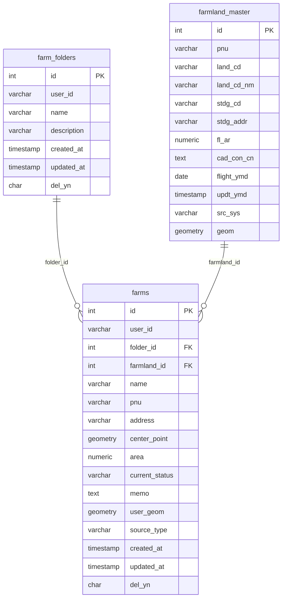

# DB 복원 설계

현재 코드에서 실제로 사용하는 DB 객체는 `farm` 스키마 기준으로 아래 3개입니다.

- `farm.farmland_master`
- `farm.farm_folders`
- `farm.farms`

기준 파일:

- [src/main/resources/mapper/map/FarmlandMapper.xml](/Users/gimjiseob/Projects/woori-farm/src/main/resources/mapper/map/FarmlandMapper.xml)
- [src/main/resources/mapper/farm/FarmMapper.xml](/Users/gimjiseob/Projects/woori-farm/src/main/resources/mapper/farm/FarmMapper.xml)
- [src/main/resources/mapper/farm/FarmStatsMapper.xml](/Users/gimjiseob/Projects/woori-farm/src/main/resources/mapper/farm/FarmStatsMapper.xml)

## 관계

## 설계 포인트

- DB는 [src/main/webapp/WEB-INF/config/context/context-datasource.xml](/Users/gimjiseob/Projects/woori-farm/src/main/webapp/WEB-INF/config/context/context-datasource.xml) 기준으로 PostgreSQL을 사용합니다.
- 공간 함수 (`ST_Contains`, `ST_AsGeoJSON`, `ST_Area`, `ST_Transform`)를 쓰므로 PostGIS가 필수입니다.
- `user_id`는 별도 사용자 테이블 FK로 강제하지 않았습니다. 현재 로그인 로직은 구글 세션값만 사용하고 DB에 사용자를 저장하지 않기 때문입니다.
- `farms.source_type`은 `MASTER` / `USER_DRAWN` 두 종류만 허용했습니다.
- `farms.current_status`는 프론트에서 사용하는 값 기준으로 `미지정`, `씨뿌림`, `모내기`, `성장중`, `수확완료`, `휴경`만 허용했습니다.

## 코드 기대 동작까지 맞춘 보완

- `farm.farms` 저장 시 `address`, `center_point`, `area`, `current_status`를 트리거로 보정합니다.
- `MASTER` 농지는 `farmland_master`에서 주소/중심점/면적을 끌어옵니다.
- `USER_DRAWN` 농지는 `user_geom`에서 중심점/면적을 계산합니다.
- 폴더는 소프트 삭제(`del_yn='Y'`)를 쓰는데, UI 설명상 폴더 삭제 시 내부 농지가 `미지정`으로 가야 하므로 관련 농지의 `folder_id`를 `NULL`로 바꾸는 트리거를 넣었습니다.

## 복원 순서

1. [database/schema.sql](/Users/gimjiseob/Projects/woori-farm/database/schema.sql) 실행
2. `farm.farmland_master` 원본 데이터 적재
3. 애플리케이션 실행 후 지도 클릭/농지 저장 동작 확인

## 참고

- `farmland_master` 데이터가 없으면 지도 클릭 기반 농지 조회와 `MASTER` 타입 등록은 동작하지 않습니다.
- 직접 그린 농지(`USER_DRAWN`) 등록은 `farmland_master` 없이도 동작합니다.
